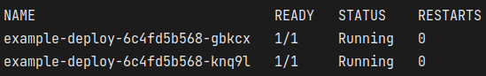

# Using Kubernetes with Python

Start
-----

```
git clone https://github.com/vadushkin/graphql-apollo-react.git
cd flask-kubernetes/
```

Kubernetes
----------


```
kubectl apply -f kubernetes/services/service.yaml
kubectl apply -f kubernetes/deployments/deployment.yaml
```

```
kubectl get pods
```
Look at them:



And copy name of ```example-deploy...```

```
kubectl port-forward example-deploy-6c4fd5b568-gbkcx 8000
```

Docker
------

```
docker-compose up
```

Docker from DockerHub
------

```
docker run vadushka/python:1.0.0
```
